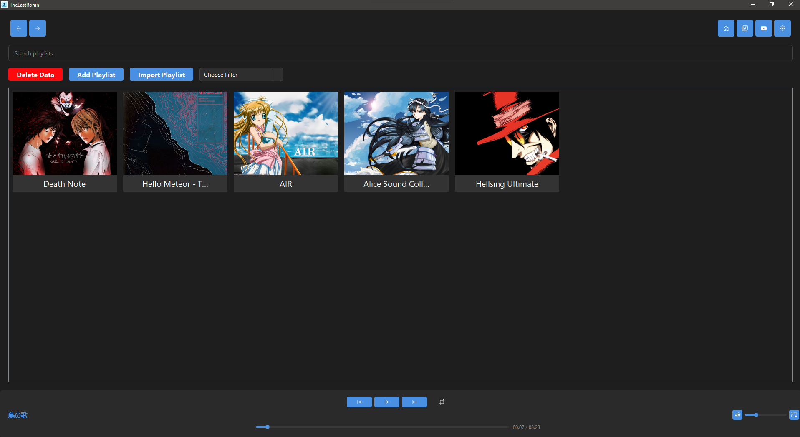
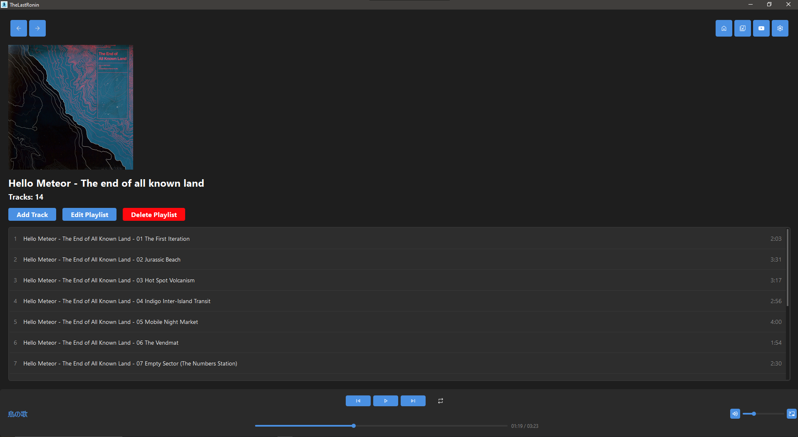
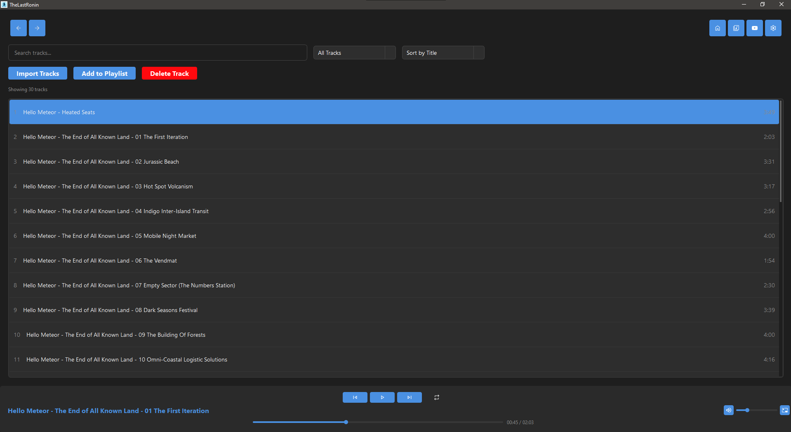

# TheLastRonin

**TheLastRonin** is a Qt-based desktop music player that lets you manage playlists and play local audio files with ease. Designed to be fast, modern, and user-friendly.

⚠️ _Work in progress – new features and improvements are on the way!_

---

## ✨ Features

- 🎵 Play local audio files
- 📁 Create and manage playlists
- 🎧 YouTube Music integration
- 📊 Music library management

---

## 📸 Screenshots

**Home Page**

**Playlist View**

**Library**

---
